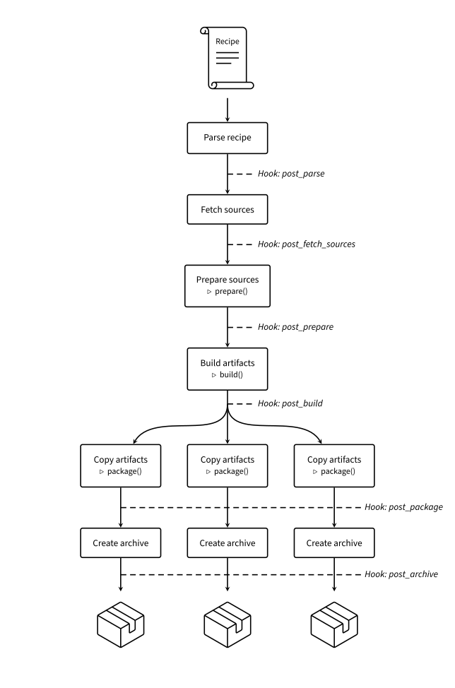

## Build Process

`toltecmk` processes recipes into packages by following a precise choreography that’s detailed in this document.
Learning more about this build process will help you write better recipes.
You can see the overall process at a glance in the diagram below.

Each block corresponds to an action taken by `toltecmk`.
Some of these actions involve executing scripts defined by the recipe: those are marked by a <small>▷</small> symbol.
In between those steps, you can see [_hooks_](#hooks) that correspond to points where you can specify custom actions to take place using the `--hook` flag.

    

### Contents

1. [Build Steps](#build-steps)
    1. [Parse recipe](#parse-recipe)
    2. [Fetch sources](#fetch-sources)
    3. [Prepare sources](#prepare-sources)
    4. [Build artifacts](#build-artifacts)
    5. [Copy artifacts](#copy-artifacts)
    6. [Create archive](#create-archive)
2. [Hooks](#hooks)
    1. [post\_parse](#post_parse)
    2. [post\_fetch\_sources](#post_fetch_sources)
    3. [post\_prepare](#post_prepare)
    4. [post\_build](#post_build)
    5. [post\_package](#post_package)
    6. [post\_archive](#post_archive)

### Build Steps

#### Parse recipe

The first step taken by the script is to parse the recipe definition into an [in-memory representation](../toltec/recipe.py).
To do this, the recipe—which is a valid Bash script—is passed to the Bash interpreter, and the set of declared variables and functions is used to construct Python objects.
Because the recipe definition is _executed_ at this step, commands with side-effects (such as those that modify the filesystem) are only allowed inside functions.

After getting the set of declared symbols, the recipe is _specialized_ for each architecture declared in the [`archs` array](recipe-format.md#archs-field).
For each architecture `<arch>`, any variable whose name is in the `<prefix>_<arch>` format is used as if it had the name `<prefix>`.
If there was already a declared variable with the name `<prefix>`, it gets overwritten if it was a string, or extended if it was an indexed array.
Variables with suffixes for other architectures get discarded.

The [post\_parse hook](#post_parse) is triggered after this step.

#### Fetch sources

At this step, each source declared in the [`source` array](recipe-format.md#source-field) is fetched into `$srcdir`, a subfolder of the workdir.
If the URI of a source starts with a protocol (`http://`, `https://`, `ftp://`, …), then it is fetched from the Internet, otherwise it is copied from the recipe’s directory.
The resulting file is named according to the basename of the URI.
After each file is fetched, its SHA-256 checksum is computed and checked against the one declared in the [`sha256sums` array](recipe-format.md#sha256sums-field).
This integrity check is skipped if the declared checksum equals `SKIP`.

After fetching a source archive (i.e., a file whose name ends in `.zip`, `.tar`, `.tar.gz`, `.tar.bz2`, or `.tar.xz`), its contents are automatically extracted unless the file is present in the [`noextract` array](recipe-format.md#noextract-field).
The auto-extraction code tries to strip as much containing folders from the archive as possible when extracting its contents; for example, if all the files in the archive are located inside a `src` folder, then this folder is omitted.

The [post\_fetch\_sources hook](#post_fetch_sources) is triggered after this step.

#### Prepare sources

After all sources have been fetched, the recipe’s [`prepare()` function](recipe-format.md#prepare-function) is executed if it exists.
This function can be used to apply patches, extract source archives that are not handled by the auto-extraction logic, clone Git repositories, or for other tasks in preparation for the build.
The function must use the `$srcdir` variable to refer to the directory in which sources have been fetched.

The [post\_prepare hook](#post_prepare) is triggered after this step.

#### Build artifacts

Before starting the build, `toltecmk` does three last preparation steps:

1. Sets the access and modification times of all files in `$srcdir` to equal the [`timestamp` field](recipe-format.md#timestamp-field). This is to ensure build reproducibility for projects that encode source file modification times inside the artifacts they generate.
2. Spins up a Docker container with the image specified in the [`image` field](recipe-format.md#image-field).
3. Installs dependencies declared in the [`makedepends` field](recipe-format.md#makedepends-field) in the container, either with `apt` for build dependencies or with `opkg` for host dependencies.

Once this is done, the recipe’s [`build()` function](recipe-format.md#build-function) is executed inside the container.
The function starts in `$srcdir` and must perform the build in that directory.

The [post\_build hook](#post_build) is triggered after this step.

#### Copy artifacts

If there are multiple packages declared in the [`pkgnames` field](recipe-format.md#pkgnames-field), then the build process forks at this point. 
For each package declared in the recipe, the corresponding [`package()` function](recipe-format.md#package-function) is executed.
The task of this function is to copy the artifacts that the package is interested in installing on the final system from `$srcdir` to `$pkgdir`.

The [post\_package hook](#post_package) is triggered after this step.

#### Create archive

In this final step, an [ipk package](ipk.md) is generated from artifacts chosen at the previous step, from recipe metadata, and from [install scripts](recipe-format.md#install-section) declared in the recipe.
To ensure reproducibility of builds, all access and modification times stored in archive metadata is set to the value in the [`timestamp` field](recipe-format.md#timestamp-field).
The resulting archives, one for each package, are placed in the dist folder.

The [post\_archive hook](#post_archive) is triggered after this step.

### Hooks

Hooks are ways of customizing the build process.
Users can create hook modules and use them by passing the `--hook` flag with a path to the module file (see [strip.py](../toltec/hooks/strip.py) for an example).
Once loaded, the rules in a hook module get applied to each recipe processed by `toltecmk`: this feature is therefore particularly useful to repositories that contain multiple recipes and wish to factor out common tasks.
Such tasks may include post-processing binary artifacts, modifying recipes, or injecting install scripts.

#### post\_parse

Triggered after a recipe has been parsed and specialized.
This is a good time for listeners to read, check, or modify recipes before any build step is performed.

**Arguments:**

* `builder`: active [Builder](../toltec/builder.py) object
* `recipe`: parsed [Recipe](../toltec/recipe.py)

#### post\_fetch\_sources

Triggered after the sources for a recipe have been fetched, checked, and extracted.

**Arguments:**

* `builder`: active [Builder](../toltec/builder.py) object
* `recipe`: parsed [Recipe](../toltec/recipe.py)
* `src_dir`: path to the directory in which sources have been extracted

#### post\_prepare

Triggered after the sources have been prepared by the recipe’s [`prepare()` function](recipe-format.md#prepare-function).

**Arguments:**

* `builder`: active [Builder](../toltec/builder.py) object
* `recipe`: parsed [Recipe](../toltec/recipe.py)
* `src_dir`: path to the directory in which sources have been prepared

#### post\_build

Triggered after the recipe’s [`build()` function](recipe-format.md#build-function) has been executed.

**Arguments:**

* `builder`: active [Builder](../toltec/builder.py) object
* `recipe`: parsed [Recipe](../toltec/recipe.py)
* `src_dir`: path to the directory in which sources have been prepared

#### post\_package

Triggered after artifacts from a build have been copied to the packaging directory.

**Arguments:**

* `builder`: active [Builder](../toltec/builder.py) object
* `recipe`: parsed [Recipe](../toltec/recipe.py)
* `src_dir`: path to the directory in which sources have been prepared
* `pkg_dir`: path to the directory in which package artifacts have been copied

#### post\_archive

Triggered after the final package archive has been generated.

**Arguments:**

* `builder`: active [Builder](../toltec/builder.py) object
* `recipe`: parsed [Recipe](../toltec/recipe.py)
* `ar_path`: path to generated [ipk package](ipk.md)
